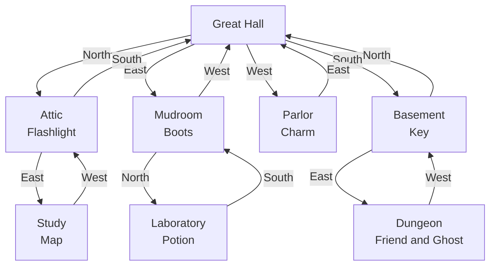
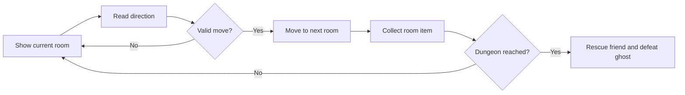

<div align="center">

# Haunted Mansion Rescue

### A Python command-line adventure through a haunted estate


[Overview](#overview) · [Game Map](#game-map) · [How to Play](#how-to-play) · [Run the Game](#run-the-game)

</div>

---

## Overview

| | |
|---|---|
| **Project** | Haunted Mansion Rescue |
| **Language** | Python |
| **Game type** | Room-based command-line adventure |
| **Starting point** | Great Hall |
| **Final location** | Dungeon |
| **Objective** | Explore the mansion, collect useful items and rescue your friend from the ghost |

The player navigates a haunted mansion by entering cardinal directions. Each room may contain an item, a new path or the route toward the final encounter in the dungeon.

## Game Map



## How to Play

1. Begin in the **Great Hall**.
2. Enter `North`, `South`, `East` or `West`.
3. Explore rooms and collect available items.
4. Reach the **Dungeon** and rescue your friend.
5. Enter `quit` at any time to exit.

## Core Gameplay



## Run the Game

```bash
git clone https://github.com/rypeguero/Text-Based-Game.git
cd Text-Based-Game
python haunted_mansion_rescue.py
```

## Python Concepts Demonstrated

`Functions` · `Dictionaries` · `Lists` · `Loops` · `Conditional Logic` · `User Input` · `String Handling` · `Game-State Tracking`

## Source Code

[**View `haunted_mansion_rescue.py`**](./haunted_mansion_rescue.py)

---

<div align="center">

**Ryan A. Peguero · Computer Science · Software Engineering**

</div>
